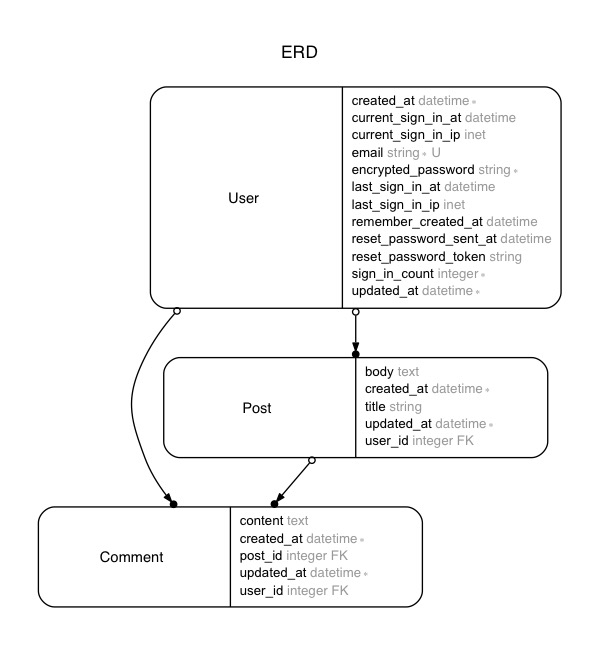

# Polymorphic like-button app

In this repo, I will demonstrate a polymorphic like-button functionality.

## Model

## References
- [ポリモーフィック関連とmodelのconcernで「いいね」を作ってみる](http://qiita.com/ken1flan/items/a803c7ac45db892ac5d5) by ken1flan
- [module option for route](https://github.com/gorails-screencasts/gorails-24-liking-posts/blob/master/config/routes.rb#L5)
